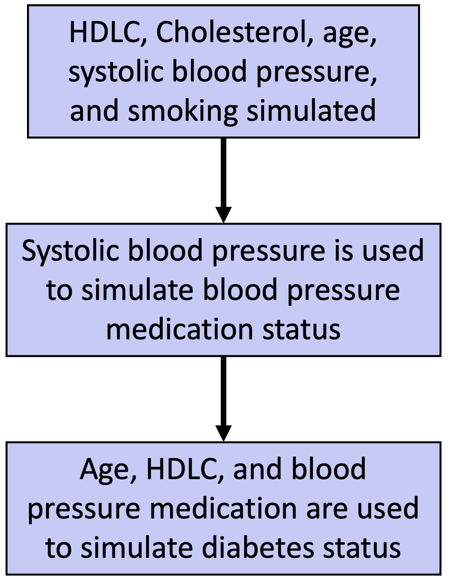

```{r setup, include=FALSE}
knitr::opts_chunk$set(echo = FALSE, warning = FALSE, message = FALSE)
```

# Using Simulations for the Transportability Analysis of a Model

### Tara Amruthur

### Abstract

Empirical investigations often span two distinct populations---the study population and the target population. The alignment of these populations is challenging, especially when constructing predictive models intended for application in the target population. Discrepancies between them can compromise model efficacy, emphasizing the need for transportability analysis.

Datasets from the Framingham Study and NHANES are leveraged to explore cardiovascular disease (CVD) prediction across diverse populations. The Framingham Study, initiated in 1948, is a longitudinal cohort investigating CVD epidemiology and risk factors. NHANES evaluates the health and nutritional status of the U.S. population, integrating self-reported and comprehensive examination data.

Population disparities between Framingham and NHANES underscore the imprudence of extrapolating model performance across datasets. Transportability analysis becomes imperative to understand model generalizability. The Brier score, a metric for probabilistic predictions, is employed, but adjustments are made to evaluate transportability. Multiple imputation addresses NHANES' missing data, and gender-specific average Brier scores are computed.

The ADEMP framework guides simulation considerations, encompassing aim, data generating mechanism, estimand, methods, and performance measures. Simulation involves diverse parameter variations for gender-specific data generation, aiming to replicate NHANES demographics.

The evaluation of simulated datasets using bias and mean squared error reveals nuanced differences between genders. Optimal correlation and blood pressure threshold values for minimizing bias and MSE are the same for men and women. The Brier score comparison and summary statistics show congruence with NHANES for women but slight discrepancies for men, potentially attributed to data variability.

The data generation process incorporates missing variables, potentially contributing to disparities in Brier scores. Computational constraints limit simulations, raising the possibility of unstable estimates. These considerations highlight areas for refining the data generation process and underscore the importance of meticulous transportability analysis in model development and application across diverse populations.

### Introduction

Empirical investigations often involve two key populations: the target and study populations. Ideally, these populations align perfectly, but achieving this alignment is challenging. Predictive model construction, based on the study population but intended for the target population, faces challenges due to discrepancies in their characteristics. Such disparities can compromise the model's efficacy when applied to the target population. Therefore, evaluating predictive accuracy alone is insufficient; transportability analysis is crucial [@steingrimsson2023transporting].

To underscore the significance of transportability analysis, we draw upon datasets derived from two disparate sources: The Framingham Study and the National Health & Nutrition Examination Survey (NHANES). Initiated by the United States Public Health Service in 1948, the Framingham Study represents an extensive observational cohort investigation dedicated to exploring the epidemiology and risk factors associated with cardiovascular disease (CVD). Evolving into a longitudinal study spanning three generations, this initiative meticulously captures data pertaining to biological and lifestyle risk factors, alongside monitoring cardiovascular, neurological, and other disease outcomes [@Framingham].

The inaugural cohort of the Framingham Study comprised 5,209 participants aged 28-62, representing two-thirds of the adult populace in Framingham, MA. Subsequently, an offspring cohort was assembled, with a third generation recruited as of 2002. Each participant underwent comprehensive evaluations encompassing medical histories, physician examinations, laboratory tests for vascular risk factors, and, in some instances, cognitive assessments and brain imaging [@Framingham].

In contrast, the NHANES, administered by the National Center for Health Statistics (NCHS), constitutes a program of studies aimed at evaluating the health and nutritional status of both adults and children in the United States. A continuous program with evolving focal points to address contemporary needs, NHANES integrates self-reported data on demographic, socioeconomic, dietary, and health-related factors. Furthermore, it encompasses a comprehensive examination entailing medical, dental, and psychological metrics [@nhanes].

The Framingham Study, rich in cardiovascular outcome data, enables the construction of models predicting predisposition to cardiovascular disease (CVD). However, NHANES lacks cardiovascular outcome information. This raises a key question: Can we predict the likelihood of cardiovascular disease in the NHANES population using a model built on Framingham data?

```{r framingham_data}
# Load in packages
library(riskCommunicator)
library(tidyverse)
library(tableone)
library(kableExtra)
library(comprehenr)
library(gridExtra)

data("framingham")

# The Framingham data has been used to create models for cardiovascular risk.
# The variable selection and model below are designed to mimic the models used
# in the paper General Cardiovascular Risk Profile for Use in Primary Care 
# This paper is available (cvd_risk_profile.pdf) on Canvas.

framingham_df <- framingham %>% dplyr::select(c(CVD, TIMECVD, SEX, TOTCHOL, AGE,
                                      SYSBP, DIABP, CURSMOKE, DIABETES, BPMEDS,
                                      HDLC, BMI))
framingham_df <- na.omit(framingham_df)

#CreateTableOne(data=framingham_df, strata = c("SEX"))

# Get blood pressure based on whether or not on BPMEDS
framingham_df$SYSBP_UT <- ifelse(framingham_df$BPMEDS == 0, 
                                 framingham_df$SYSBP, 0)
framingham_df$SYSBP_T <- ifelse(framingham_df$BPMEDS == 1, 
                                framingham_df$SYSBP, 0)

# Looking at risk within 15 years - remove censored data
#dim(framingham_df)
framingham_df <- framingham_df %>%
  filter(!(CVD == 0 & TIMECVD <= 365*15)) %>%
  dplyr::select(-c(TIMECVD))
#dim(framingham_df)

# Filter to each sex
framingham_df_men <- framingham_df %>% filter(SEX == 1)
framingham_df_women <- framingham_df %>% filter(SEX == 2)

# Fit models with log transforms for all continuous variables
mod_men <- glm(CVD~log(HDLC)+log(TOTCHOL)+log(AGE)+log(SYSBP_UT+1)+
                 log(SYSBP_T+1)+CURSMOKE+DIABETES, 
      data= framingham_df_men, family= "binomial")


mod_women <- glm(CVD~log(HDLC)+log(TOTCHOL)+log(AGE)+log(SYSBP_UT+1)+
                   log(SYSBP_T+1)+CURSMOKE+DIABETES, 
               data= framingham_df_women, family= "binomial")
```

```{r nhanes_data}
# The NHANES data here finds the same covariates among this national survey data
library(nhanesA)

# blood pressure, demographic, bmi, smoking, and hypertension info
bpx_2017 <- nhanes("BPX_J") %>% 
  dplyr::select(SEQN, BPXSY1, BPXDI1) %>% 
  rename(SYSBP = BPXSY1, DIABP = BPXDI1)
demo_2017 <- nhanes("DEMO_J") %>% 
  dplyr::select(SEQN, RIAGENDR, RIDAGEYR) %>% 
  rename(SEX = RIAGENDR, AGE = RIDAGEYR)
bmx_2017 <- nhanes("BMX_J") %>% 
  dplyr::select(SEQN, BMXBMI) %>% 
  rename(BMI = BMXBMI)
smq_2017 <- nhanes("SMQ_J") %>%
  mutate(CURSMOKE = case_when(SMQ040 %in% c(1,2) ~ 1,
                              SMQ040 == 3 ~ 0, 
                              SMQ020 == 2 ~ 0)) %>%
  dplyr::select(SEQN, CURSMOKE)
bpq_2017 <- nhanes("BPQ_J") %>% 
  mutate(BPMEDS = case_when(
    BPQ020 == 2 ~ 0,
    BPQ040A == 2 ~ 0,
    BPQ050A == 1 ~ 1,
    TRUE ~ NA )) %>%
  dplyr::select(SEQN, BPMEDS) 
tchol_2017 <- nhanes("TCHOL_J") %>% 
  dplyr::select(SEQN, LBXTC) %>% 
  rename(TOTCHOL = LBXTC)
hdl_2017 <- nhanes("HDL_J") %>% 
  dplyr::select(SEQN, LBDHDD) %>% 
  rename(HDLC = LBDHDD)
diq_2017 <- nhanes("DIQ_J") %>% 
  mutate(DIABETES = case_when(DIQ010 == 1 ~ 1, 
                              DIQ010 %in% c(2,3) ~ 0, 
                              TRUE ~ NA)) %>%
  dplyr::select(SEQN, DIABETES) 

# Join data from different tables
df_2017 <- bpx_2017 %>%
  full_join(demo_2017, by = "SEQN") %>%
  full_join(bmx_2017, by = "SEQN") %>%
  full_join(hdl_2017, by = "SEQN") %>%
  full_join(smq_2017, by = "SEQN") %>%
  full_join(bpq_2017, by = "SEQN") %>%
  full_join(tchol_2017, by = "SEQN") %>%
  full_join(diq_2017, by = "SEQN")

#CreateTableOne(data = df_2017, strata = c("SEX"))
```

### Data

Preceding the commencement of the transportability analysis, an exploratory data analysis was undertaken. The interrelations among numeric columns within the NHANES data are illustrated in Figure 1. It is discerned that systolic blood pressure exhibits a pronounced correlation with age, diastolic blood pressure, and body mass index (BMI). Furthermore, a notable correlation is observed between total cholesterol and systolic blood pressure, along with high-density lipoprotein cholesterol (HDLC).

```{r, fig.height = 3, fig.align='center'}
library(corrplot)
numeric_nhanes <- df_2017 %>%
  dplyr::select(SYSBP, DIABP, AGE, BMI, HDLC, TOTCHOL)
numeric_nhanes <- numeric_nhanes[complete.cases(numeric_nhanes),]
corrplot(cor(numeric_nhanes),
         type = 'lower',
         method = 'square',
         tl.col = 'black',
         cl.cex = 0.4)
```

**Figure 1. Correlation Plot for NHANES Data**

In Figure 2, the inter-column correlations within the numeric variables of the Framingham data are presented. Notably, akin to the NHANES data, discernible correlations are evident between systolic blood pressure and diastolic blood pressure, age, and BMI. However, it is noteworthy that the strength of correlations for other variables in the Framingham data appears comparatively less pronounced than those observed in the NHANES dataset. This discrepancy underscores a substantive distinction between the two datasets.

```{r, fig.height = 3, fig.align = 'center'}
numeric_fram <- framingham_df %>%
  dplyr::select(SYSBP, DIABP, AGE, BMI, HDLC, TOTCHOL)
numeric_fram <- numeric_fram[complete.cases(numeric_fram),]
corrplot(cor(numeric_fram),
         type = 'lower',
         method = 'square',
         tl.col = 'black',
         cl.cex = 0.4)
```

**Figure 2. Correlation Plot for Framingham Data**

In the Framingham dataset, there is no missing data. Conversely, the NHANES dataset manifests several columns with a noticeable amount of missing observations, as depicted in Table 1. A clear pattern emerges: missing HDLC data aligns with missing total cholesterol data, and vice versa. Similarly, missing systolic blood pressure data coincides with missing diastolic blood pressure data. While no other clear patterns are evident, it is crucial to note the substantial number of missing observations in the blood pressure medication column.

Considering Table 1, focusing solely on complete cases would result in a significant loss of information. There are only 1,480 complete observations compared to the 9,254 observations in the entire dataset. This emphasizes the importance of addressing missing data systematically, as relying only on complete cases could mean sacrificing valuable information in the dataset.

```{r}
# Patterns of Missingness
# No missing values in Framingham
# Multiple Imputation
missing_2017 <- as.data.frame(apply(X = is.na(df_2017), MARGIN = 2, FUN = sum))
colnames(missing_2017) <- 'Missing Values'

kbl(missing_2017, booktabs = T, escape = F, caption = 'Number of Missing Values by Column (NHANES)') %>%
  kable_styling(latex_options = "HOLD_position")
```

Table 2 provides a comprehensive summary of data related to male participants from both the Framingham and NHANES studies, while Table 3 offers a similar summary for female participants. Notably, both tables highlight significant differences in the cohorts under scrutiny. Specifically, the NHANES dataset shows a higher prevalence of individuals under blood pressure medication, with diabetes, or exhibiting elevated body mass index (BMI). In contrast, notable characteristics within the Framingham population include a comparatively advanced mean age and elevated cholesterol levels.

These population differences are significant as they explain potential factors contributing to varying model performances across datasets. In particular, the observed dissimilarities emphasize the imprudence of extrapolating the performance of a model trained on one dataset (Framingham) to another distinct dataset (NHANES). The variations in age, health conditions, and other biological metrics between the populations underscore the necessity for meticulous transportability analysis. Such analysis becomes imperative to gain insights into the generalizability of models derived from one population to another with disparate demographic and clinical characteristics.

```{r summary_table}
library(gtsummary)

complete_cases <- df_2017[complete.cases(df_2017),]
eligible_2017 <- complete_cases %>%
  filter(AGE >= 30) %>%
  dplyr::select(c("SEX", "TOTCHOL", "AGE", "BMI", "SYSBP", "HDLC", 
           "CURSMOKE", "BPMEDS", "DIABETES", "DIABP"))

eligible_2017$CVD <- NA

eligible_2017$SYSBP_UT <- ifelse(eligible_2017$BPMEDS == 0, 
                                 eligible_2017$SYSBP, 0)
eligible_2017$SYSBP_T <- ifelse(eligible_2017$BPMEDS == 1, 
                                eligible_2017$SYSBP, 0)

framingham_df <- framingham_df %>%
  dplyr::select(c("SEX", "TOTCHOL", "AGE", "BMI", "SYSBP", "HDLC", 
           "CURSMOKE", "BPMEDS", "DIABETES", "CVD", "SYSBP_UT", 
           "SYSBP_T", "DIABP"))

final_df <- rbind(framingham_df, eligible_2017)
final_df <- final_df %>%
  mutate(S = case_when(is.na(CVD) ~ 0,
                       TRUE ~ 1))

final_df %>%
  mutate(COHORT = case_when(S == 1 ~ 'FHS',
                            S == 0 ~ 'NHANES')) %>%
  mutate(GENDER = case_when(SEX == 1 ~ 'Male',
                            SEX == 2 ~ 'Female')) %>%
  filter(GENDER == 'Male') %>%
  tbl_summary(by = COHORT, 
              include = (-c(S,GENDER, SEX, SYSBP_UT, SYSBP_T)),
              statistic = list(all_continuous() ~ "{mean} ({sd})"),
              label = c(TOTCHOL ~ 'Total Cholesterol',
                        AGE ~ 'Age',
                        BMI ~ 'BMI',
                        SYSBP ~ 'Systolic Blood Pressure',
                        DIABP ~ 'Diastolic Blood Pressure',
                        HDLC ~ 'High Density Lipoprotein Cholesterol (HDLC)',
                        CURSMOKE ~ 'Current Smoker',
                        BPMEDS ~ 'Blood Pressure Medication',
                        CVD ~ 'Cardiovascular Disease',
                        DIABETES ~ 'Diabetes'
                        )
  ) %>%
  modify_spanning_header(c("stat_1", "stat_2") ~ "**Study**") %>%
  as_gt() %>%
  gt::tab_header(title = "Table 2. Summary Statistics for Men by Study")


final_df %>%
  mutate(COHORT = case_when(S == 1 ~ 'FHS',
                            S == 0 ~ 'NHANES')) %>%
  mutate(GENDER = case_when(SEX == 1 ~ 'Male',
                            SEX == 2 ~ 'Female')) %>%
  filter(GENDER == 'Female') %>%
  tbl_summary(by = COHORT, 
              include = (-c(S,GENDER, SEX, SYSBP_UT, SYSBP_T)),
              statistic = list(all_continuous() ~ "{mean} ({sd})"),
              label = c(TOTCHOL ~ 'Total Cholesterol',
                        AGE ~ 'Age',
                        BMI ~ 'BMI',
                        SYSBP ~ 'Systolic Blood Pressure',
                        DIABP ~ 'Diastolic Blood Pressure',
                        HDLC ~ 'High Density Lipoprotein Cholesterol (HDLC)',
                        CURSMOKE ~ 'Current Smoker',
                        BPMEDS ~ 'Blood Pressure Medication',
                        CVD ~ 'Cardiovascular Disease',
                        DIABETES ~ 'Diabetes'
                        )
  ) %>%
  modify_spanning_header(c("stat_1", "stat_2") ~ "**Study**") %>%
  as_gt() %>%
  gt::tab_header(title = "Table 3. Summary Statistics for Women by Study")
```

### Transportability Analysis

A metric commonly employed for assessing the precision of probabilistic predictions is the Brier score, particularly pertinent in the context of binary outcomes, such as the occurrence of cardiovascular disease. In this scenario, a predictive model furnishes probabilities for each potential outcome, indicating, for instance, a 10% probability of cardiovascular disease and a 90% probability of its absence. The Brier score is computed as the mean of the squared differences between these predictions and the corresponding actual outcomes (binary values of 0 or 1), expressed by the following formula:

$$
Brier = \frac{1}{N}\sum_{i=1}^{N}(f_t - o_t)^2
$$

where $f_t$ represents the prediction for the $\text{t}^{th}$ event and $o_t$ represents the corresponding observed outcome [@Goldstein-Greenwood_2021].

However, to evaluate the transportability of our model from the source population to the target population, adjustments are necessary to the Brier score formula. Introducing an indicator variable $S$, where a value of 1 signifies that an observation originates from the source population and 0 indicates derivation from the target population, leads to the modified Brier score formula:

$$
\hat{\psi}_{\hat{\beta}} = \frac{\sum_{i=1}^{n}I(S_i = 1) \hat{o}(X_i)(Y_i - g_{\hat{\beta}}(X_i))^2}{\sum_{i=1}^{n}I(S_i = 0)}
$$

Here, $\hat{o}(X_i)$ represents an estimator for the inverse odds weights, defined as:

$$
\hat{o}(X) = \frac{Pr[S = 0 |X]}{Pr[S = 1|X]}
$$

[@steingrimsson2023transporting].

Given the substantial amount of missing data within the NHANES dataset, multiple imputation techniques were employed. Five imputed datasets were generated, and for each of these datasets, individuals not meeting the criteria of the Framingham study (specifically, aged 30+) were filtered out. Subsequently, the Brier score was computed for each filtered dataset, and these values were averaged to yield the gender-specific average Brier scores, as detailed in Table 4.

```{r brier_score}
library(mice)
library(kableExtra)

# Multiple Imputation for NHANES data
m <- 5
mice_data_out <- mice(df_2017[,-1], m, pri=F)

calculate_weights <- function(data) {
#' Function to calculate the weights
#' @param data, the data used for building the model
#'
#' @return vector of weights

  model <- glm(S ~ ., data = data, family = "binomial")
  S1 <- predict(model, type = "response")
  
  return((1-S1)/S1)
  
}

brier_score <- function(data, sex) {
#' Function to calculate the Brier Score by sex
#' @param data, the data to analyze
#' @param sex, the sex to calculate the Brier Score for
#' 
#' @return brier score
  
  wt <- data %>%
    filter(SEX == sex & S == 1) %>%
    pull(weights)
  
  nhanes <- data %>%
    filter(SEX == sex & S == 0) %>%
    nrow()
  
  framingham <- data %>%
    filter(S == 1 & SEX == sex)
  
  if (sex == 1) {
    pred = predict(mod_men, type = 'response')
    return(sum(wt * (framingham$CVD - pred)^2)/nhanes)
  } else {
    pred = predict(mod_women, type = 'response')
    return(sum(wt * (framingham$CVD - pred)^2)/nhanes)
  }
}


# Initialize empty vector for male and female Brier scores for each imputed dataset
scores_male <- c()
scores_female <- c()

# Loop through each imputed dataset, calculate the weights, and then the Brier scores
for (i in 1:m) {
  
  data <- complete(mice_data_out, i)
  data <- data %>%
    filter(AGE >= 30) %>%
    dplyr::select(c("SEX", "TOTCHOL", "AGE", "BMI", "SYSBP", "HDLC", 
           "CURSMOKE", "BPMEDS", "DIABETES", "DIABP"))
  data$CVD <- NA
  
  data$SYSBP_UT <- ifelse(data$BPMEDS == 0, data$SYSBP, 0)
  data$SYSBP_T <- ifelse(data$BPMEDS == 1, data$SYSBP, 0)
  
  combined_df <- rbind(framingham_df, data) %>%
    mutate(S = case_when(is.na(CVD) ~ 0,
                       !(is.na(CVD)) ~ 1))
  
  weights <- calculate_weights(combined_df %>% dplyr::select(-c(CVD, SEX, DIABP)))
  combined_df <- cbind(combined_df, weights)
  
  scores_male <- c(scores_male, brier_score(combined_df, 1))
  scores_female <- c(scores_female, brier_score(combined_df, 2))
  
}

# Create a table with the average Brier scores across imputed datasets by gender
brier_df <- data.frame(brier = c(mean(scores_male), mean(scores_female)))
rownames(brier_df) <- c("Male", "Female")
colnames(brier_df) <- c("Brier Score")

kbl(brier_df, booktabs = T, escape = F, caption = 'Brier Scores by Gender') %>%
  kable_styling(latex_options = "HOLD_position")
```

### Data Simulation

The ADEMP framework, an invaluable tool for conceptualizing simulation challenges, delineates five pivotal considerations antecedent to the initiation of a simulation study. These factors encompass aim, data generating mechanism, estimand, methods, and performance measures.

**Aims:** The objective of this endeavor is to employ summary-level data adeptly to simulate individual-level data representative of our target population, constituting the demographic substratum underpinning the NHANES survey data.

**Data Generating Mechanism:** Data generation was performed separately by gender. The methodology was the same for both genders, but there were different parameter values. The process is outlined in Figure 3.

```{r, echo = FALSE, out.width ='100px', fig.align='center'}
library(knitr)

```

**Figure 3: Data Generating Mechanism**

Notably, the interdependence between HDLC and cholesterol prompted their simulation through a multivariate normal distribution, where the correlation between both variables was varied to find the optimal correlation. Age, as seen in Figure 4, seems to most closely follow a uniform distribution, so it was generated accordingly, with the range of distribution being between 30 and 80. Similarly, systolic blood pressure appears to roughly follow a normal distribution, so the variable was generated using the normal distribution, with distribution parameters being drawn from Table 2 and Table 3.

The binary variable for smoking was modeled using a binomial distribution, with the probability of smoking being extracted from Table 2 and Table 3. The variable for blood pressure medication usage was generated based on systolic blood pressure. Varying thresholds were used for this; if the systolic blood pressure was larger than the threshold, the individual was simulated to be on blood pressure medication and conversely, if the blood pressure was less than the threshold, the individual was simulated to not be on blood pressure medication. These varying thresholds ranged from 120 to 140, which was determined based on the criteria for elevated blood pressure and hypertension as provided by the Mayo Clinic [@mayo].

For diabetes, a predictive model was built on the Framingham data, with age, HDLC, and blood pressure medication status being used as predictors. The predicted probabilities from this model was used as the probability parameter in the binomial distribution used to generate this variable. To handle computational constraints, 500 iterations were executed for each permutation of parameter variations. A seed of 1 was used for replicability of results.

```{r, fig.height = 3.5}
# Age histogram
age <- ggplot(eligible_2017) + 
  geom_histogram(aes(x = AGE), color = "black", fill = "white") +
  labs(title = 'Distribution of Age',
       x = 'Age',
       y = 'Count')
# SYSBP histogram
sysbp <- ggplot(eligible_2017) +
  geom_histogram(aes(x = SYSBP), color = "black", fill = "white") +
  labs(title = 'Distribution of Systolic Blood Pressure',
       x = 'Systolic Blood Pressure',
       y = 'Count')

grid.arrange(age, sysbp, nrow = 2, ncol = 1)
```

**Figure 4: Distribution of Age and Systolic Blood Pressure**

**Estimand:** The estimand, denoted as $\hat{\psi}_{\hat{\beta}}$, assumes the form of the Brier Risk estimator, serving as a metric to gauge model performance within the target population.

**Methods:** The estimand was computed using the original NHANES dataset and applied to diverse simulated datasets to discern the variant that most faithfully mirrors the inherent population structure of NHANES.

**Performance Measures:** Both mean squared error and bias were employed as performance measures, affording a quantitative assessment of the accuracy inherent in the simulated data.

### Results

The evaluation of simulated datasets entailed the application of two distinct metrics: bias and mean squared error (MSE). The discrepancies in bias and MSE across different correlation values are more pronounced for men, though still relatively small with lower correlations. As the total cholesterol and HDLC become more correlated, the bias and MSE increase, as seen in Figure 5. We are also able to determine that the $\rho$ that results in the least amount of bias is 0.4 for both genders.

Similarly, we are also able to see the average bias and MSE across the different blood pressure thresholds. For both metrics, a similar trend is observed, where they are closer to the true Brier score as the threshold increases. However, the decrease in error appears to be more pronounced for men than women. An examination of this figure reveals that the best blood pressure threshold is 140 for both genders.

```{r, fig.height = 6.5, fig.align='center'}
library(MASS)
library(ghibli)

sim_men <- readRDS('sim_results_men_1.rds')
sim_women <- readRDS('sim_results_women_1.rds')


est_men <- mean(scores_male)
x <- sim_men %>% 
  group_by(rho, thresh) %>% 
  summarise(bias = mean(brier - est_men)) %>%
  ungroup() %>%
  slice_min(abs(bias), n = 1)

est_women <- mean(scores_female)
y <- sim_women %>% 
  group_by(rho, thresh) %>% 
  summarise(bias = mean(brier - est_men)) %>%
  ungroup() %>%
  slice_min(abs(bias), n = 1)

#sim_men %>% filter(rho == 0.4, thresh == 140) %>% summarise(mean(brier))


brier_men <- ggplot(sim_men %>% filter(rho == 0.4, thresh == 140)) +
  geom_line(aes(x = iter, y = brier)) +
  geom_hline(yintercept=est_men, linetype="dashed", 
                color = "red", size=2) +
  labs(title = 'Brier Score by Iteration',
       x = 'Iteration',
       y = 'Brier Score')

brier_women <- ggplot(sim_women %>% filter(rho == 0.4, thresh == 140)) +
  geom_line(aes(x = iter, y = brier)) +
  geom_hline(yintercept=est_women, linetype="dashed", 
                color = "red", size=2) +
  labs(title = 'Brier Score by Iteration',
       x = 'Iteration',
       y = 'Brier Score')

sim_men_scores <- sim_men %>%
  group_by(rho,thresh) %>%
  summarise(brier = mean(brier),
            bias = mean(brier - est_men),
            MSE = mean((brier - est_men)^2))


est_women <- mean(scores_female)
sim_women_scores <- sim_women %>%
  group_by(rho,thresh) %>%
  summarise(brier = mean(brier),
            bias = mean(brier - est_women),
            MSE = mean((brier - est_women)^2))

best_cor_m <- sim_men_scores %>%
  group_by(rho) %>%
  summarise(avg_brier = mean(brier),
            avg_bias = mean(bias),
            ymin = avg_bias - sd(bias),
            ymax = avg_bias + sd(bias),
            avg_MSE = mean(MSE),
            min_MSE = avg_MSE - sd(MSE),
            max_MSE = avg_MSE + sd(MSE))
best_cor_m$sex <- 'Male'

best_cor_w <- sim_women_scores %>%
  group_by(rho) %>%
  summarise(avg_brier = mean(brier),
            avg_bias = mean(bias),
            ymin = avg_bias - sd(bias),
            ymax = avg_bias + sd(bias),
            avg_MSE = mean(MSE),
            min_MSE = avg_MSE - sd(MSE),
            max_MSE = avg_MSE + sd(MSE))
best_cor_w$sex <- 'Female'

best_cor <- rbind(best_cor_m, best_cor_w)


best_thresh_m <- sim_men_scores %>%
  group_by(thresh) %>%
  summarise(avg_brier = mean(brier),
            avg_bias = mean(bias),
            ymin = avg_bias - sd(bias),
            ymax = avg_bias + sd(bias),
            avg_MSE = mean(MSE),
            min_MSE = avg_MSE - sd(MSE),
            max_MSE = avg_MSE + sd(MSE))
best_thresh_m$sex <- 'Male'

best_thresh_w <- sim_women_scores %>%
  group_by(thresh) %>%
  summarise(avg_brier = mean(brier),
            avg_bias = mean(bias),
            ymin = avg_bias - sd(bias),
            ymax = avg_bias + sd(bias),
            avg_MSE = mean(MSE),
            min_MSE = avg_MSE - sd(MSE),
            max_MSE = avg_MSE + sd(MSE))
best_thresh_w$sex <- 'Female'

best_thresh <- rbind(best_thresh_m, best_thresh_w)


cor_bias_plot <- ggplot(best_cor, aes(x = rho, y = avg_bias, color = sex)) +
  geom_line() +
  geom_point() +
  geom_errorbar(aes(ymin=ymin, ymax=ymax), width=.05,
                 position=position_dodge(0.0)) +
  scale_x_continuous(n.breaks = 10) +
  scale_color_manual(name = 'Sex', labels = c('Female',
                                              'Male'),
                      values = ghibli_palette('LaputaMedium')[c(3,6)]) +
  labs(title = 'Average Bias by Correlation',
       x = 'Correlation',
       y = 'Average Bias') +
  theme_minimal()

thresh_bias_plot <- ggplot(best_thresh, aes(x = thresh, y = avg_bias, color = sex)) +
  geom_line() +
  geom_point() +
  geom_errorbar(aes(ymin=ymin, ymax=ymax), width=.05,
                 position=position_dodge(0.0)) +
  scale_x_continuous(n.breaks = 5) +
  scale_color_manual(name = 'Sex', labels = c('Female',
                                              'Male'),
                      values = ghibli_palette('LaputaMedium')[c(3,6)]) +
  labs(title = 'Average Bias by BP Threshold',
       x = 'BP Threshold',
       y = 'Average Bias') +
  theme_minimal()

cor_MSE_plot <- ggplot(best_cor, aes(x = rho, y = avg_MSE, color = sex)) +
  geom_line() +
  geom_point() +
  geom_errorbar(aes(ymin=min_MSE, ymax=max_MSE), width=.05,
                 position=position_dodge(0.0)) +
  scale_x_continuous(n.breaks = 10) +
  scale_color_manual(name = 'Sex', labels = c('Female',
                                              'Male'),
                      values = ghibli_palette('LaputaMedium')[c(3,6)]) +
  labs(title = 'Average MSE by Correlation',
       x = 'Correlation',
       y = 'Average MSE') +
  theme_minimal()

thresh_MSE_plot <- ggplot(best_thresh, aes(x = thresh, y = avg_MSE, color = sex)) +
  geom_line() +
  geom_point() +
  geom_errorbar(aes(ymin=min_MSE, ymax=max_MSE), width=.05,
                 position=position_dodge(0.0)) +
  scale_x_continuous(n.breaks = 5) +
  scale_color_manual(name = 'Sex', labels = c('Female',
                                              'Male'),
                      values = ghibli_palette('LaputaMedium')[c(3,6)]) +
  labs(title = 'Average MSE by BP Threshold',
       x = 'BP Threshold',
       y = 'Average MSE') +
  theme_minimal()

grid.arrange(cor_bias_plot, cor_MSE_plot, thresh_bias_plot, thresh_MSE_plot, 
             nrow = 4, ncol = 1)
```

**Figure 5. Average Bias and MSE by Correlation and Threshold**

With the optimal parameters ($\rho = 0.4$ and a blood pressure threshold of 140), the Brier score across all 500 iterations was plotted in Figure 6. The red line in both plots delineates the actual Brier score value for each gender. From Figure 6, we are able to see that the Brier scores for the simulated female data seem to oscillate around the true value. This is indicative that the simulated female data is able to replicate the behavior of the underlying NHANES population accurately.

On the other hand, we see that the simulated male data oscillates around a Brier score of 0.15, which is approximately 0.06 from the true Brier score value. This indicates that the simulated male data is not an accurate representation of the underlying NHANES population, and therefore, more alterations to the data generating mechanism need to be made. That being said, this margin of error is not too substantial.

```{r}
grid.arrange(brier_men, brier_women, nrow = 2, ncol = 1)
```

**Figure 6. Average Brier Score by Iteration with Best Parameters For Men (Top) and Women (Bottom)**

Employing the previously defined correlation and blood pressure threshold values, the dataset underwent simulation (using seed 1), and subsequently, the Brier score was computed. Additionally, comprehensive summary tables of the simulated data were generated, facilitating a comparative analysis of its congruence with the summary tables used in the initial data generation process.

From Table 5, we are able to see that the Brier score for the female data is very close to the true Brier score, which corroborates what is illustrated in Figure 6. Similarly, the Brier score for the male data performs slightly worse. Upon examination of the summary statistics for the simulated data, as shown in Table 6, we see that the prevalence of blood pressure medication and diabetes are significantly lower in the simulated data than in the actual data.

```{r}
# Using the optimal parameters (rho = 0.4, threshold = 140) simulate the data
set.seed(1)
cov_mat <- function(sd1, sd2, rho) {
  #' Calculate the covariance matrix provided two standard deviations and the correlation
  #' @param sd1, the standard deviation of the first variable
  #' @param sd2, the standard deviation of the second variable
  #' @param rho, the correlation between the two variables
  #' 
  #' @return matrix, the variance-covariance matrix
  
  cov_mat = matrix(0, nrow = 2, ncol = 2)
  cov_mat[1,1] <- sd1^2
  cov_mat[1,2] <- rho * sd1 * sd2
  cov_mat[2,1] <- rho * sd1 * sd2
  cov_mat[2,2] <- sd2^2 
  
  return(cov_mat)
  
}

# Load in diabetes model
diabetes_mod <- readRDS('diabetes_mod.rds')


# Calculate the values for both men and women
nhanes_men <- eligible_2017 %>% filter(AGE >= 30 & SEX == 1)
nhanes_women <- eligible_2017 %>% filter(AGE >= 30 & SEX == 2)

n_m <- nrow(nhanes_men)
n_w <- nrow(nhanes_women)

mean_m <- as.data.frame(t(apply(X = nhanes_men, MARGIN = 2, FUN = mean)))
sd_m <- as.data.frame(t(apply(X = nhanes_men, MARGIN = 2, FUN = sd)))

mean_w <- as.data.frame(t(apply(X = nhanes_women, MARGIN = 2, FUN = mean)))
sd_w <- as.data.frame(t(apply(X = nhanes_women, MARGIN = 2, FUN = sd)))

cov_matrix_m <- cov_mat(sd_m$HDLC, sd_m$TOTCHOL, 0.4)
cov_matrix_w <- cov_mat(sd_w$HDLC, sd_w$TOTCHOL, 0.4)

chol_var_m <- mvrnorm(n_m, mu = c(mean_m$HDLC, mean_m$TOTCHOL), Sigma = cov_matrix_m)
chol_var_w <- mvrnorm(n_w, mu = c(mean_w$HDLC, mean_w$TOTCHOL), Sigma = cov_matrix_w)
  
HDLC_m <- chol_var_m[,1]
TOTCHOL_m <- chol_var_m[,2]
HDLC_w <- chol_var_w[,1]
TOTCHOL_w <- chol_var_w[,2]

SYSBP_m <- rnorm(n_m, mean_m$SYSBP, sd_m$SYSBP)
SYSBP_w <- rnorm(n_w, mean_w$SYSBP, sd_w$SYSBP)

AGE_m <- round(runif(n_m, 30, 80))
AGE_w <- round(runif(n_w, 30, 80))

BP_MEDS_m <- as.numeric(SYSBP_m >= 140)
BP_MEDS_w <- as.numeric(SYSBP_w >= 140)

CURSMOKE_m <- rbinom(n_m, 1, mean_m$CURSMOKE)
CURSMOKE_w <- rbinom(n_w, 1, mean_m$CURSMOKE)

SEX_m <- rep(1, n_m)
SEX_w <- rep(2, n_w)
  
data_m <- data.frame(HDLC = HDLC_m, TOTCHOL = TOTCHOL_m, SYSBP = SYSBP_m, AGE = AGE_m, 
                     BPMEDS = BP_MEDS_m, CURSMOKE = CURSMOKE_m, SEX = SEX_m)
data_w <- data.frame(HDLC = HDLC_w, TOTCHOL = TOTCHOL_w, SYSBP = SYSBP_w, AGE = AGE_w, 
                     BPMEDS = BP_MEDS_w, CURSMOKE = CURSMOKE_w, SEX = SEX_w)
  
x_vars <- model.matrix(CURSMOKE ~ AGE + HDLC + BPMEDS, data = data_m)
probs <- x_vars %*% coef(diabetes_mod)
probs <- exp(probs)/(1 + exp(probs))
data_m$DIABETES <- to_vec(for(i in 1:length(probs)) rbinom(1,1,probs[i]))

x_vars <- model.matrix(CURSMOKE ~ AGE + HDLC + BPMEDS, data = data_w)
probs <- x_vars %*% coef(diabetes_mod)
probs <- exp(probs)/(1 + exp(probs))
data_w$DIABETES <- to_vec(for(i in 1:length(probs)) rbinom(1,1,probs[i]))

# Bind both men and women data together
data <- rbind(data_m, data_w)

data$CVD <- NA

# Add in same variables in the Framingham data
data$SYSBP_UT <- ifelse(data$BPMEDS == 0, data$SYSBP, 0)
data$SYSBP_T <- ifelse(data$BPMEDS ==1, data$SYSBP, 0)

framingham_df <- framingham_df %>%
  dplyr::select('HDLC', 'TOTCHOL', 'SYSBP', 'AGE', 'BPMEDS', 'CURSMOKE', 'SEX', 'DIABETES', 'CVD', 'SYSBP_UT', 'SYSBP_T')

# Combine data and create an indicator for if Framingham data or not
combined_df <- rbind(framingham_df, data) %>%
mutate(S = case_when(is.na(CVD) ~ 0,
                       TRUE ~ 1))

# Calculate the weights and then the Brier score
# Then display in a table
weights <- calculate_weights(combined_df %>% dplyr::select(-CVD))
combined_df <- cbind(combined_df, weights)
  
score_male <- brier_score(combined_df, 1)
score_female <- brier_score(combined_df, 2)

brier_scores_sim <- data.frame(brier = c(score_male, score_female), true = c(est_men, est_women))
colnames(brier_scores_sim) <- c('Simulated Brier Score', 'True Brier Score')
rownames(brier_scores_sim) <- c('Male', 'Female')
kbl(brier_scores_sim, booktabs = T, escape = F, caption = 'Brier Scores of Best Simulated Data Compared to True Brier Score') %>%
  kable_styling(latex_options = 'HOLD_position')
```

```{r}
# Summary table by gender
data %>%
  mutate(SEX = case_when(SEX == 1 ~ 'Male',
                         SEX == 2 ~ 'Female')) %>%
  tbl_summary(by = SEX, include = c(TOTCHOL, AGE, SYSBP, HDLC, CURSMOKE, BPMEDS, DIABETES),
              statistic = list(all_continuous() ~ "{mean} ({sd})"),
              label = c(TOTCHOL ~ 'Total Cholesterol',
                        AGE ~ 'Age',
                        SYSBP ~ 'Systolic Blood Pressure',
                        HDLC ~ 'High Density Lipoprotein Cholesterol (HDLC)',
                        CURSMOKE ~ 'Current Smoker',
                        BPMEDS ~ 'Blood Pressure Medication',
                        DIABETES ~ 'Diabetes'
                        )) %>%
  as_gt() %>%
  gt::tab_header(title = "Table 6. Summary Statistics by Gender")
```

### Discussion

As elucidated in Table 5, the Brier score exhibits a closer concordance with the actual Brier score derived from NHANES data for women than for men. Specifically, the Brier score for the simulated male dataset displays an approximate deviation of 0.03.

Upon scrutinizing the summary statistics presented in Table 6, a salient observation emerges. By employing the multivariate normal distribution for HDLC and total cholesterol, we successfully generated individual-level data in the simulated datasets that closely approximates the actual NHANES data for both genders. Nevertheless, discernible disparities between the simulated and actual datasets manifest, indicating potential avenues for improvement.

Notably, the use of a blood pressure threshold might not be the only variable contributing to blood pressure medication status. Similarly, the model for diabetes, relying only on age, HDLC, and blood pressure medication, might need more predictors to accurately predict the probabilities of diabetes for each individual.

### Limitations & Future Research

These findings prompt a consideration of potential refinements to the data generation process. For instance, the utilization of alternative distributions may enhance the generation of variables such as systolic blood pressure and age. Furthermore, the present data generation strategy encompasses only the variables employed in the Framingham models, yet there may be merit in incorporating additional variables present in the dataset but excluded from the model. Variables such as BMI and diastolic blood pressure, which exhibit relatively robust relationships with other variables according to correlation plots, could be judicious additions to the data generation process to foster a more comprehensive representation of the underlying population.

The data generation process relied on a dataset characterized by the presence of several missing variables. The extent of this missing data may be a contributing factor to the observed disparities in Brier scores between the simulated and actual datasets. Furthermore, the limited number of simulations conducted was constrained by computational and time considerations. This constraint introduces the possibility of unstable Brier score estimates for various parameter combinations.

### Conclusion

In conclusion, this study emphasizes the challenge of aligning study and target populations in predictive modeling. Using Framingham and NHANES datasets, we assessed the transportability of cardiovascular disease (CVD) prediction models, revealing population disparities. Despite certain congruences, variations in age, blood pressure, and medication usage suggest areas for model refinement.

The impact of missing data and computational constraints was acknowledged, prompting the exploration of alternative distributions and additional variables for improved simulations. While Brier score discrepancies were observed, not reaching substantial levels, our findings underscore the need for ongoing refinement in predictive modeling methodologies.

Future research should prioritize refining simulation techniques, addressing missing data issues, and exploring variable inclusion strategies to enhance model accuracy. This study highlights the complexity of predictive modeling across diverse populations, emphasizing the ongoing need for improvements in pursuit of reliable and transportable models.

### Acknowledgements

This analysis has been performed with help from Dr. Jon Steingrimsson from the School of Public Health at Brown University.

\newpage

## Code Appendix:

```{r ref.label=knitr::all_labels(), echo=TRUE, eval=FALSE, tidy = TRUE, tidy.opts = list(width.cutoff = 50)}
```

\newpage

## References
